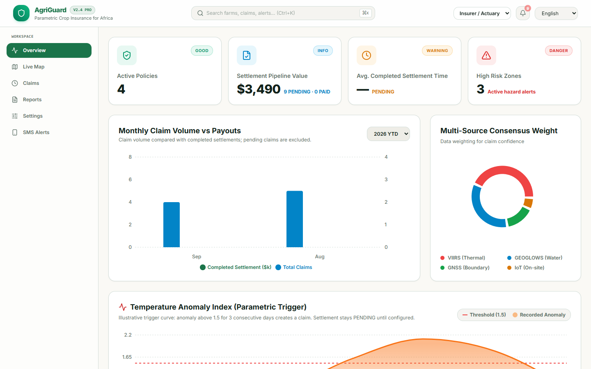
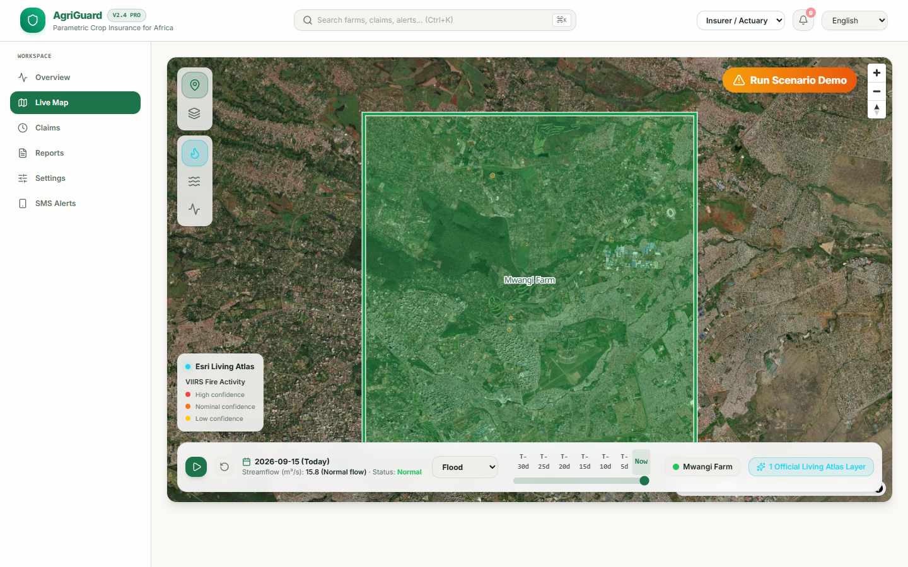
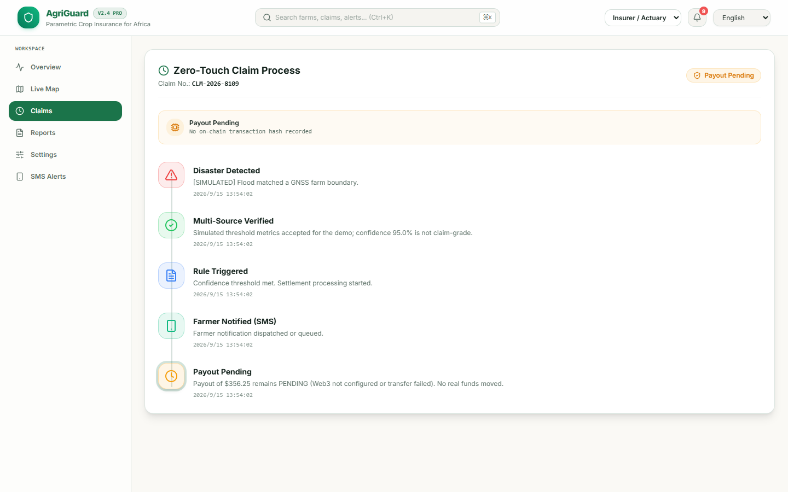
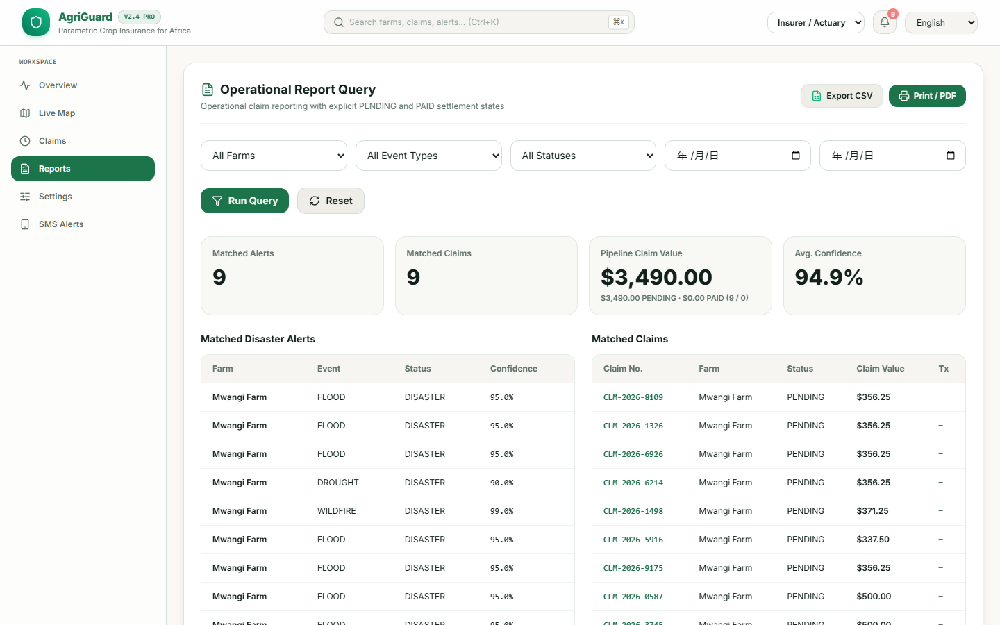
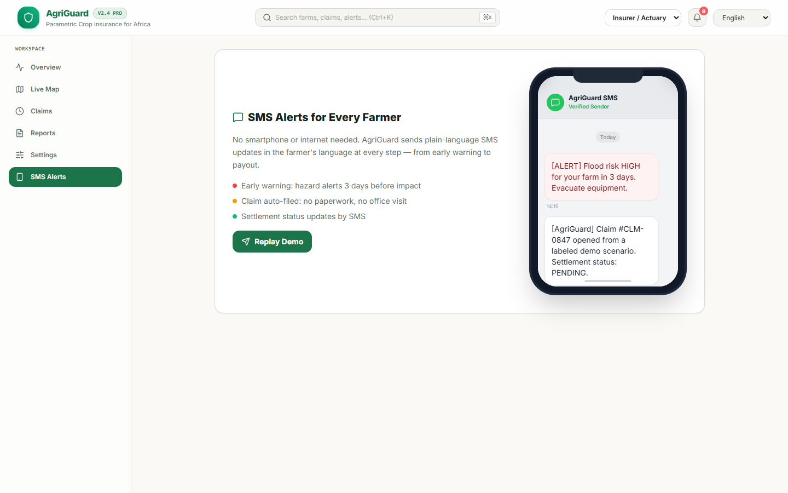
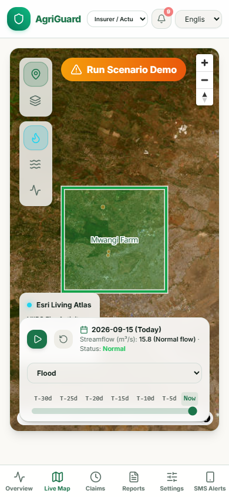

# 🌍 AgriGuard — Space-Grade Parametric Crop Insurance

> **Parametric crop insurance for smallholder farmers — automated with GNSS and satellite data, with an auditable ERC-20 settlement path and SMS-first delivery.**

[](https://dorahacks.io/hackathon/satnav/detail)
[](LICENSE)
[](https://www.djangoproject.com/)
[](https://postgis.net/)
[](https://soliditylang.org/)



## Live Judge Demo

- Application: [https://agri-guard-api-live.vercel.app](https://agri-guard-api-live.vercel.app)
- Login: `demo` / `demo123`
- Persistence: PostgreSQL + PostGIS on Supabase (session pooler)
- Real-time updates: REST + WebSocket (`/ws/alerts/`)

The Vercel deployment is the stable judge-facing entry point. Claims and disaster
events survive redeploys. OpenAI, Twilio, and on-chain settlement remain in safe
mock or `PENDING` mode unless both their production credentials and explicit
`LIVE_*` gates are enabled.

---

## 📑 Table of Contents

- [🎯 The Problem](#-the-problem)
- [💡 The Solution](#-the-solution)
- [✅ MVP Status & Evidence Boundary](#-mvp-status--evidence-boundary)
- [🏗️ Architecture](#%EF%B8%8F-architecture)
- [🧠 How Parametric Insurance Works](#-how-parametric-insurance-works)
- [🚀 Key Features](#-key-features)
- [🛠️ Tech Stack](#%EF%B8%8F-tech-stack)
- [⚡ Quick Start](#-quick-start)
- [📺 Demo & Presentation](#-demo--presentation)
- [🧪 Testing the Trigger Pipeline](#-testing-the-trigger-pipeline)
- [📊 Impact & Market](#-impact--market)
- [🏆 Judging Criteria Mapping](#-judging-criteria-mapping)
- [🛰️ GNSS Data & Evidence](#%EF%B8%8F-gnss-data--evidence)
- [🌍 UN Sustainable Development Goals](#-un-sustainable-development-goals)
- [🗂️ Repository Layout](#%EF%B8%8F-repository-layout)
- [👥 Team & Submission](#-team--submission)
- [📜 License](#-license)

---

## 🎯 The Problem

> **9.3 billion USD per year in uninsured climate losses hit smallholder farmers in Sub-Saharan Africa. Less than 3% have any form of crop insurance.**

Traditional insurance is broken:

| Pain Point | Reality Today |
|:---|:---|
| Claim filing | 2-12 weeks of paperwork, in-person surveys |
| Payout | Loss-adjusters, opaque valuation, disputes |
| Cost | $50-100 per policy, premiums eat 30% of income |
| Coverage | 96%+ of farms excluded; only big-agra eligible |
| Trust | Fraud suspicions, denied claims, no receipts |

**The result**: One bad season drives 6 million families into bankruptcy. Climate change is making this worse — every year.

## 💡 The Solution

**AgriGuard** inverts the model. Instead of paying claims for **what happened** on a specific farm (loss-adjustment), we evaluate measurable hazard thresholds and GNSS-defined farm footprints.

```
   🛰️  NASA EONET / ArcGIS  ──> live hazard events and forecast layers
            │
            ▼
   🗄️  PostGIS spatial       ──> intersects with GNSS farm polygons
            │
            ▼
   🧠  Parametric engine      ──> evaluates crop-specific thresholds
            │
            ▼
   ⛓️  Settlement service     ──> ERC-20 transfer or explicit PENDING status
            │
            ▼
   📱  Twilio SMS            ──> farmer gets confirmation + AI report
            │
            ▼
   🌾  Farm recovers
```

**No routine loss adjuster. No paperwork. A transparent settlement status.**

| Metric | Traditional | **AgriGuard target** |
|:---|---:|---:|
| Time to payout | **12 weeks** | **3 minutes** |
| Cost per policy | $50-100 | **Low-cost automation target** |
| Fraud rate | 15-20% | **Reduced via GNSS evidence** |
| Coverage of smallholders | < 3% | **SMS-first access target** |
| Required documents | 10+ forms | **0** |

---

## ✅ MVP Status & Evidence Boundary

AgriGuard is a working MVP, not a claim that every production integration is already live. The submission is strongest when this boundary is explicit:

| Capability | Status in this repository |
|:---|:---|
| GNSS/WGS84 farm polygons | **Implemented** with PostGIS `PolygonField`, spatial intersection, optional device ID, accuracy, and capture timestamp metadata |
| NASA EONET ingestion | **Implemented** as event-footprint monitoring with a six-hour Celery Beat schedule in the Docker worker stack; the Vercel API container does not host the scheduler, and ingestion never invents flood-depth or fire-area thresholds |
| Esri Living Atlas layers | **Integrated live** on the map for VIIRS fire activity, GEOGLOWS streamflow, and stream gauges |
| Parametric evaluation | **Implemented** with crop-specific flood, wildfire, drought, and heatwave rules |
| REST + WebSocket workflow | **Implemented** for farms, events, alerts, claims, timelines, and live dashboard updates |
| AI damage report | **Implemented** with OpenAI when configured; credential-only setup stays on the deterministic fallback until `LIVE_AI_ENABLED=True` |
| SMS delivery | **Implemented** with Twilio when configured; credential-only setup stays in labeled mock mode until `LIVE_SMS_ENABLED=True` |
| ERC-20 settlement | **Implemented code path** using a configured oracle wallet and token contract; credentials alone stay `PENDING` unless `LIVE_SETTLEMENT_ENABLED=True`, and no fake transaction hash is ever created |
| Solidity policy contract | **Reference implementation** included for the planned insurer escrow phase; the current backend does not call it |
| Threshold ingestion from GEOGLOWS/VIIRS | **Production roadmap**: the map consumes live layers, while the demo trigger uses clearly marked simulated metrics |
| Raw GNSS/NMEA trace upload | **Production roadmap**; the MVP accepts the resulting WGS84 polygon and capture metadata |

The one-click demo intentionally simulates threshold metrics so judges can see the complete workflow without paid API keys or real funds. The UI and API label those claims as simulated or pending where applicable.

---

## 🏗️ Architecture

📐 **Architecture Diagram:** see the full Mermaid diagram in [`docs/ARCHITECTURE.md`](docs/ARCHITECTURE.md)

```
┌──────────────┐    ┌──────────────┐    ┌──────────────┐    ┌──────────────┐
│   DATA       │    │  PROCESSING  │    │ APPLICATION  │    │  FRONTEND    │
│              │    │              │    │              │    │              │
│ • NASA EONET │───>│ • Celery     │───>│ • Django     │<──>│ • React 19 + │
│ • VIIRS      │    │ • PostGIS    │    │ • DRF API    │    │  MapLibre GL │
│ • GEOGLOWS   │    │ • Django Sig │    │ • Channels   │    │ react-map-gl │
└──────────────┘    └──────────────┘    └──────────────┘    └──────────────┘
                                              │
                                              ▼
                                    ┌──────────────────┐
                                    │   WEB3 + AI      │
                                    │                  │
                                    │ • Solidity       │
                                    │   AgriGuard-     │
                                    │   Parametric.sol │
                                    │ • OpenAI model   │
                                    │ • Twilio SMS     │
                                    └──────────────────┘
```

---

## 🧠 How Parametric Insurance Works

Parametric insurance can **settle automatically** when a measurable parameter crosses a threshold. In AgriGuard, the trigger creates an auditable claim when **the farm's GNSS boundary intersects a verified disaster footprint or labeled demo area**. A configured settlement path can then execute the transfer.

```python
# core/tasks.py — the heart of the trigger
@shared_task
def process_disaster_event(event_id):
    event = DisasterEvent.objects.get(id=event_id)

    # 1. PostGIS spatial intersection: which farms are in the danger zone?
    affected_farms = Farm.objects.filter(
        geofence__intersects=event.affected_area   # ← the parametric check
    )

    for farm in affected_farms:
        # 2. Claim value = $25/ha x capped insured area (<=5ha)
        #    x severity Level (1-3) x confidence score
        payout = engine.process_payout(
            farm, event, trigger_results
        )["amount"]

        # 3. Create the claim in PENDING state before any settlement attempt
        claim = Claim.objects.create(
            farm=farm, status="PENDING", payout_amount=payout, tx_hash=None
        )

        # 4. A configured successful ERC-20 transfer can move the claim to PAID.
        #    Missing credentials or a failed transfer leave it PENDING.

        # 5. WebSocket push to live dashboard
        channel_layer.group_send('alerts_group', {'type': 'send_alert', ...})

        # 6. Generate AI damage report (configured model or deterministic fallback)
        generate_ai_damage_report.delay(alert.id)

        # 7. Queue SMS status to the farmer via Twilio or mock fallback
        send_sms_alert.delay(farm.phone_number, f"Claim status: {claim.status}")
```

> Full code in [`docs/TRIGGER_LOGIC_AND_CODE.md`](docs/TRIGGER_LOGIC_AND_CODE.md) — including the Solidity contract, Django signals, and NASA EONET ingestion.

---

## 🚀 Key Features

### 1. **Real-time WebSocket Alerts**
Django Channels pushes claim and alert updates to connected dashboards.

### 2. **Interactive Geospatial Visualization**
MapLibre GL map (react-map-gl) rendering farm geofences and live disaster polygons — see disaster zones in context.

### 3. **AI Damage Assessment**
The configured OpenAI model generates crop loss estimates and recovery guidance from the available event context.

### 4. **Multilingual UI**
English, French, Kiswahili, Chinese, Spanish, Portuguese, and Arabic.

### 5. **Auditable Settlement Path**
The backend can sign an ERC-20 transfer from a configured insurer/oracle wallet. `contracts/AgriGuardParametric.sol` is included as the policy-escrow reference implementation; it is not invoked by the current MVP.

> ⚠️ If Web3 credentials or a wallet are missing, the claim is recorded as `PENDING` with no fabricated transaction hash. The interactive demo uses this safe fallback.

### 6. **SMS Alerts（USSD 规划中）**
Farmers receive claim updates via SMS (Twilio, with Mock fallback). A USSD channel for basic feature phones is planned — see [Roadmap](#-roadmap).

---

## 🛠️ Tech Stack

| Layer | Technology |
|:---|:---|
| **Backend** | Django 4.2 + Django REST Framework + GeoDjango |
| **Database** | PostgreSQL 15 + PostGIS 3.3 (spatial queries) |
| **Async Tasks** | Celery 5.3 + Redis 7 |
| **Real-time** | Django Channels + Daphne WebSocket |
| **AI** | OpenAI chat model (configurable via `OPENAI_MODEL`) |
| **SMS** | Twilio API (with Mock fallback) |
| **Blockchain** | Solidity + Web3.py (Ethereum-compatible) |
| **Frontend** | React 19 + Vite + MapLibre GL (react-map-gl) |
| **Geospatial** | PostGIS spatial queries + MapLibre/Esri map rendering |
| **i18n** | react-i18next (EN/FR/SW/ZH/ES/PT/AR) — `frontend/src/i18n/config.js` |
| **Container** | Docker + Docker Compose |
| **API** | DRF REST: `/api/farms/` · `/api/events/` · `/api/alerts/` · `/api/claims/` |

See [`docs/TECH_STACK.md`](docs/TECH_STACK.md) for the complete architecture.

---

## ⚡ Quick Start

### Prerequisites
- Docker 24+ and Docker Compose
- Node.js 20+ (for the React frontend)
- Git

### One-line setup

```bash
git clone https://github.com/juangh123/agri_guard.git
cd agri_guard
./start.ps1   # Windows  •  ./start.sh on macOS/Linux
```

The `start.ps1` script will:
1. Build and start all 6 Docker services (db, web, redis, celery, celery-beat, frontend)
2. Run `makemigrations` + `migrate`
3. Prompt you to create a Django superuser
4. Open the API at `http://127.0.0.1:8000/api/`

### Manual setup (cross-platform)

```bash
# 1. Build & run containers. The web service automatically runs migrations
#    and seeds demo users/farms on first start.
docker compose up -d --build

# 2. Open in browser
#    - Frontend:  http://localhost:5173
#    - Django Admin:  http://localhost:8000/admin
#    - API:  http://localhost:8000/api/
```

Demo login accounts created by `seed_demo_data`:

- Insurer demo: `demo` / `demo123` (intentionally unprivileged)
- Farmer: `farmer` / `farmer123`

The public demo credentials are deliberately not staff or superuser accounts.
Create a separate `createsuperuser` account when Django admin access is needed.

### Frontend setup (local dev)

```bash
cd frontend
npm install
npm run dev
```

### Local fallback (Windows, no Docker)

If Docker Desktop cannot start (for example when BIOS virtualization is disabled), use the
portable PostgreSQL/PostGIS runner instead:

```powershell
python -m venv .venv
.\.venv\Scripts\python.exe -m pip install -r requirements-local.txt
.\start_local.ps1
```

The script starts PostgreSQL/PostGIS from `postgresql-binaries`, applies migrations, seeds demo
data, and launches Daphne and Vite. Celery tasks run eagerly and WebSocket notifications use an
in-memory channel layer, so no Redis service is required for the local demo. The alert consumer
also polls the shared database for new alerts (`ALERT_DB_POLL_INTERVAL`, default 3s), which keeps
multiple server instances in sync even without Redis.

### Environment variables

Copy `.env.example` to `.env` and fill in:

```bash
# Required
SECRET_KEY=<django-secret>
DATABASE_URL=postgis://postgres:postgres@db:5432/agri_guard_db
CELERY_BROKER_URL=redis://redis:6379/0

# Optional (will gracefully degrade to Mock mode if not set)
OPENAI_API_KEY=<your-openai-key>
OPENAI_MODEL=gpt-4o-mini
LIVE_AI_ENABLED=False
TWILIO_ACCOUNT_SID=<your-sid>
TWILIO_AUTH_TOKEN=<your-token>
TWILIO_PHONE_NUMBER=<your-twilio-number>
LIVE_SMS_ENABLED=False
WEB3_PROVIDER_URI=<your-rpc-url>
WEB3_PRIVATE_KEY=<your-private-key>
LIVE_SETTLEMENT_ENABLED=False
```

> 🔒 The repository ships **without** any `.env` — secrets are never committed. See `.gitignore`.
>
> Real SMS and on-chain transfers stay disabled unless the corresponding
> `LIVE_*_ENABLED` flag is explicitly set to `True`.

---

## 📺 Demo & Presentation

### 🎥 Interactive Demo (no install needed)

**[Open the interactive demo →](docs/INTERACTIVE_DEMO.html)**

A self-contained HTML simulation of the full pipeline — login → dashboard → disaster trigger → settlement status → SMS → AI report. Works offline, in any modern browser.

> Open `docs/INTERACTIVE_DEMO.html` directly in Chrome/Edge/Firefox. Click **▶ Start Auto-Demo** in the bottom-left for an automated walkthrough, or step through manually.

### 📊 Demo Screenshots

| Step | Screenshot | What it shows |
|:---:|:---|:---|
| 1 |  | Portfolio KPIs with pending pipeline value separated from completed settlements |
| 2 |  | MapLibre/Esri map with GNSS farm boundaries and live disaster layers |
| 3 |  | Auditable claim timeline ending in explicit `PENDING`, with no fake TxHash |
| 4 |  | Operational report separating `$ PENDING` from `$ PAID` |
| 5 |  | Multilingual SMS status update showing `PENDING` settlement |
| 6 |  | Mobile layout for low-bandwidth field use |

### 📑 Pitch Deck

Full 12-slide presentation: **[`docs/AgriGuard_Presentation_submission.pptx`](docs/AgriGuard_Presentation_submission.pptx)**

Or in Markdown form: **[`docs/SUBMISSION_FULL.md`](docs/SUBMISSION_FULL.md)** · **[`docs/pitch/PITCH_SCRIPT.md`](docs/pitch/PITCH_SCRIPT.md)**

---

## 🧪 Testing the Trigger Pipeline

After setup, you can trigger a test disaster event end-to-end:

```bash
# 1. Easiest demo path: log in as demo/demo123 and click
#    "Run Scenario Demo" on the dashboard. The frontend calls
#    POST /api/events/simulate/ and runs the full pipeline.

# 2. Or trigger via Django admin:
#    http://localhost:8000/admin/core/disasterevent/add/

# 3. Or trigger via API:
python trigger_demo.py
# Output: "Triggering analysis for Event ID: 1..."
#         "Result: {'status': 'analysis triggered'}"

# 4. Or fetch NASA EONET events automatically (monitoring only):
docker compose exec web python manage.py fetch_nasa_eonet
```

Watch the Celery worker logs to see the full chain:
```bash
docker compose logs -f celery
```

You should see:
```
New DisasterEvent detected: 1. Triggering analysis task...
Processed Event 1. Affected Farms: 3. New Alerts/Payouts: 3.
Mock SMS Sent Successfully!
```

---

## 📊 Impact & Market

| Metric | Year 1 | Year 2 | Year 3 |
|:---|---:|---:|---:|
| Farmers insured | 5,000 | 25,000 | **120,000+** |
| Countries | 2 (KE, NG) | 5 | 10+ |
| Disaster types | Flood, Drought | + Heatwave | + Hail, Locusts |
| Maximum per-claim payout (5 ha cap) | $375 | $375 | $375 |
| Bankruptcy rate reduction | –20% | –40% | **–60%** |

### Market Sizing

- **TAM**: 485M African smallholder livelihoods exposed to climate losses → **$9.3B / yr**
- **SAM**: Sub-Saharan Africa + SE Asia = 120M farms → **$2.4B / yr**
- **SOM**: Pilot 2 countries (Kenya, Nigeria) = 12M farms → **$240M / yr**

**Year-3 revenue target: ~$3M ARR** (1% SOM penetration = 120,000 policies × $25/policy margin)

> Full impact analysis in [`docs/IMPACT_AND_MARKET.md`](docs/IMPACT_AND_MARKET.md)

---

## 🏆 Judging Criteria Mapping

AgriGuard maps each official G4-SAA judging criterion to concrete evidence:
`Originality`, `Sustainability`, `Significance`, `Applicability and Transferability`, `Market Potential`, and `Impact`.

See [`docs/JUDGING_CRITERIA_MAPPING.md`](docs/JUDGING_CRITERIA_MAPPING.md).

## 🛰️ GNSS Data & Evidence

GNSS farm boundaries and receiver/accuracy/timestamp metadata are stored for each polygon, spatially intersected in PostGIS, and linked to claims through SHA-256 evidence hashes. The production roadmap extends this with raw trace ingestion and on-chain policy metadata.

See [`docs/GNSS_DATA_CAPTURE_AND_EVIDENCE.md`](docs/GNSS_DATA_CAPTURE_AND_EVIDENCE.md).

---

## 🌍 UN Sustainable Development Goals

| SDG | Alignment |
|:---:|:---|
| **1** No Poverty | Target: parametric liquidity helps prevent disaster-driven farm bankruptcies |
| **2** Zero Hunger | Stabilizes smallholder food production |
| **9** Industry & Innovation | Integrated GNSS, Earth-observation, and settlement-status workflow |
| **13** Climate Action | Turns climate risk into a financialized hedge |

---

## 🗂️ Repository Layout

```
agri_guard/
├── config/                     # Django project config (settings, celery, asgi)
├── core/                       # Main app
│   ├── models.py               # Farm, DisasterEvent, RiskAlert
│   ├── tasks.py                # Celery tasks (process_disaster_event, send_sms, AI)
│   ├── signals.py              # Auto-trigger on new disaster event
│   ├── views.py                # DRF ViewSets
│   ├── serializers.py          # GeoJSON serializers
│   ├── urls.py
│   ├── consumers.py            # WebSocket consumer
│   └── management/commands/
│       └── fetch_nasa_eonet.py # Celery Beat schedule: NASA EONET every 6 hours (Docker stack)
├── contracts/                  # Reference Solidity contract (AgriGuardParametric.sol)
├── frontend/                   # React 19 + MapLibre/Esri app
│   ├── src/pages/
│   │   ├── Login.jsx
│   │   ├── Register.jsx        # Farmer onboarding (GNSS + phone)
│   │   └── Dashboard.jsx       # Map + analytics + alert feed
│   ├── src/i18n/config.js      # i18n: EN/FR/SW/ZH/ES/PT/AR
│   └── package.json
├── docs/                       # Hackathon submission materials
│   ├── INTERACTIVE_DEMO.html   # Self-contained demo (open in browser)
│   ├── AgriGuard_Presentation_submission.pptx
│   ├── SUBMISSION_FULL.md      # Combined submission document
│   ├── ARCHITECTURE.md         # Mermaid system diagram
│   ├── TRIGGER_LOGIC_AND_CODE.md
│   ├── IMPACT_AND_MARKET.md
│   ├── TECH_STACK.md
│   ├── JUDGING_CRITERIA_MAPPING.md
│   ├── GNSS_DATA_CAPTURE_AND_EVIDENCE.md
│   ├── pitch/                  # Pitch materials
│   │   ├── PITCH.md            # 90s pitch + 250-word abstract
│   │   ├── PITCH_SCRIPT.md
│   │   └── DECK_OUTLINE.md
│   └── screenshots/            # Six current verified captures plus legacy reference images
├── docker-compose.yml
├── Dockerfile
├── requirements.txt
├── start.ps1                   # One-line Windows setup
├── .env.example                # Template (real .env is gitignored)
└── README.md                   # ← You are here
```

---

## 👥 Team & Submission

| | |
|:---|:---|
| **Hackathon** | GNSS 4 for Space Applications in Africa (G4-SAA) — SATNAV Africa Joint Programme |
| **Submission Track** | **Challenge II — Synergizing Agriculture and Geomatics**; disaster risk reduction is addressed through flood, drought, and wildfire triggers |
| **Built with** | Django, PostGIS, MapLibre, Esri Living Atlas, Solidity, OpenAI, Twilio |
| **Team** | Jason (juangh123) — solo builder |
| **Demo Video** | [`docs/AgriGuard_Demo_Final.mp4`](docs/AgriGuard_Demo_Final.mp4) — rebuilt against the current honest-settlement UI |
| **Presentation** | [`docs/AgriGuard_Presentation_submission.pptx`](docs/AgriGuard_Presentation_submission.pptx) |
| **Submission URL** | _Pending DoraHacks submission — update after the BUIDL is created_ |

---

## 🔮 Roadmap

- [ ] **Q4 2026** — Regional insurer pilot with additional GNSS/EO validation layers
- [ ] **Q1 2027** — Mobile app with offline-first SMS sync
- [ ] **Q2 2027** — IoT soil sensors for additional validation layer
- [ ] **Q3 2027** — USSD channel for non-smartphone farmers
- [ ] **Q4 2027** — Open API for partner NGOs and governments

---

## 📜 License

MIT — see [`LICENSE`](LICENSE)

---

## 🙏 Acknowledgments

- **NASA EONET** for the open disaster event stream
- **MapLibre** and **Esri Living Atlas / Africa GeoPortal** for the interactive mapping stack
- **GNSS 4 for Space Applications in Africa (G4-SAA) / SATNAV Africa Joint Programme** for organising the hackathon
- **OpenAI** for accessible AI
- **Twilio** for the SMS infrastructure

---

> **The Earth is speaking through satellite data. We're building the translation layer so the smallholder farmer gets paid — in minutes, not months.**
