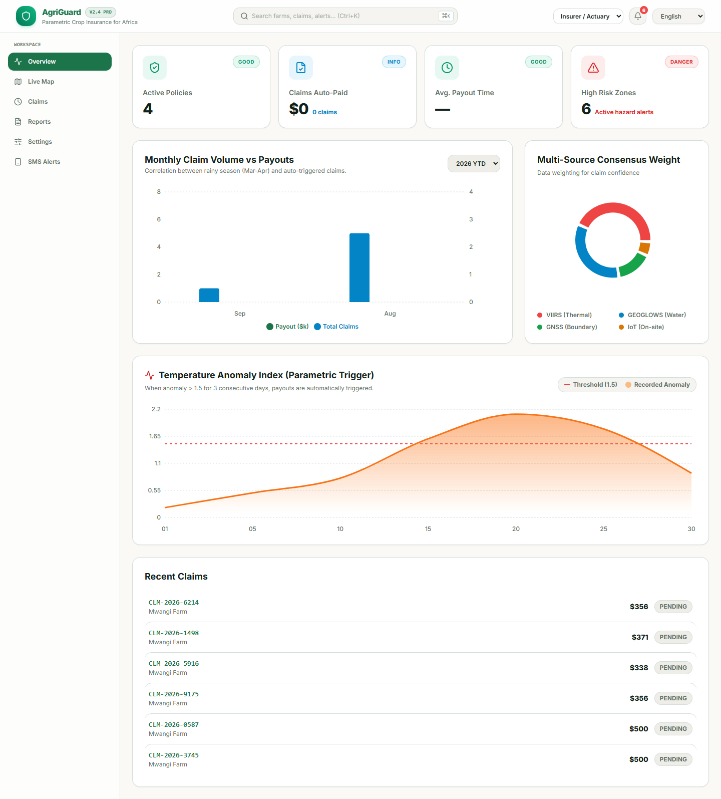
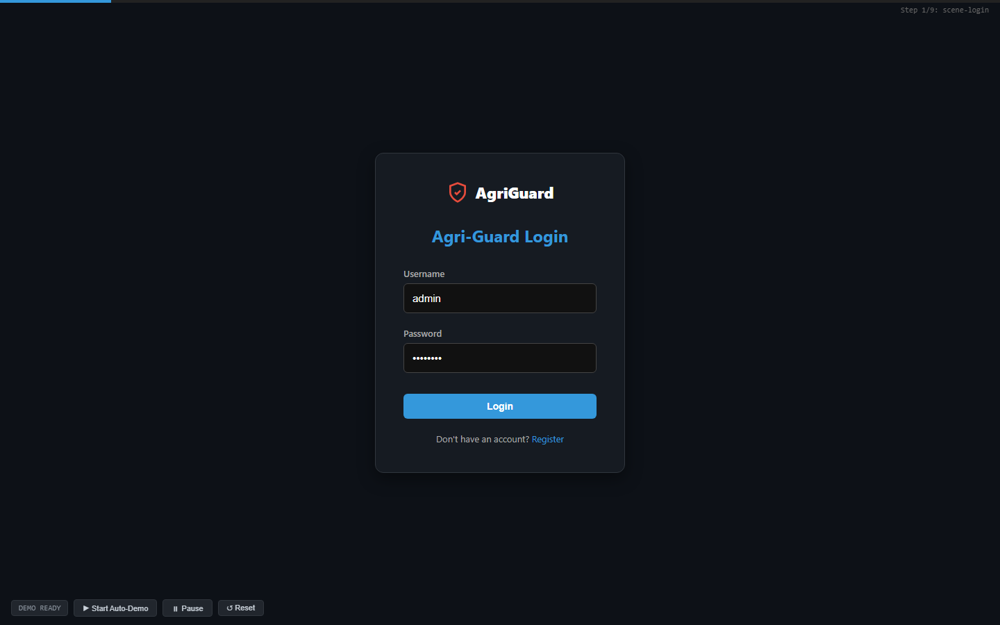
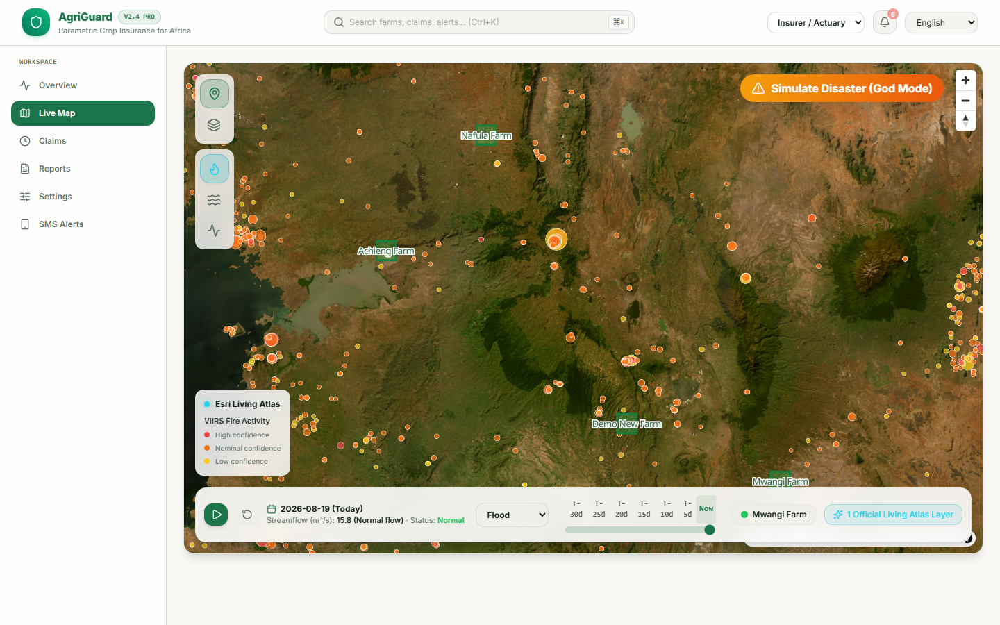
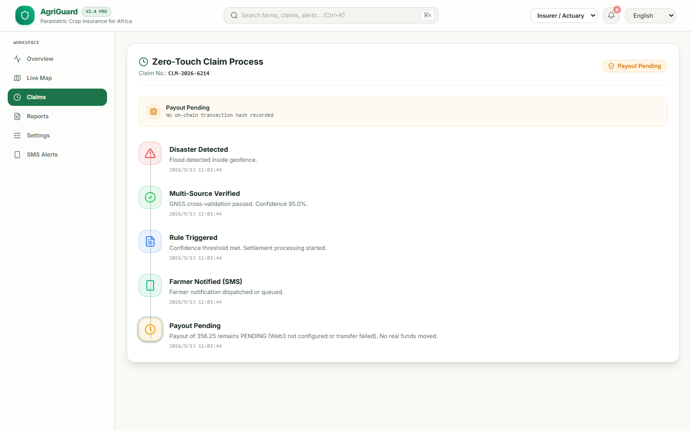
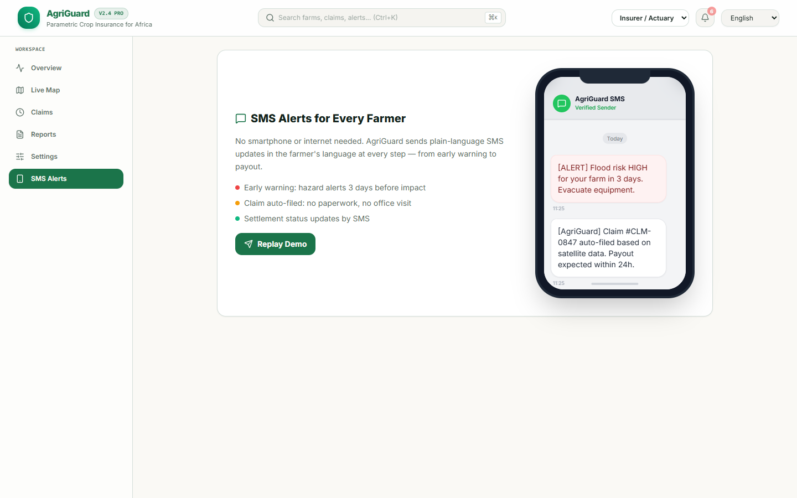
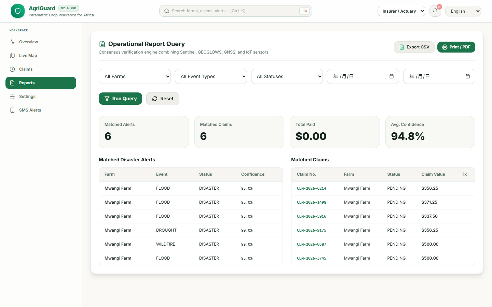

# 🌍 AgriGuard — Space-Grade Parametric Crop Insurance

> **Parametric crop insurance for smallholder farmers — automated by satellites, settled on-chain, delivered via SMS in minutes.**

[](https://dorahacks.io/)
[](LICENSE)
[](https://www.djangoproject.com/)
[](https://postgis.net/)
[](https://soliditylang.org/)



---

## 📑 Table of Contents

- [🎯 The Problem](#-the-problem)
- [💡 The Solution](#-the-solution)
- [🏗️ Architecture](#%EF%B8%8F-architecture)
- [🧠 How Parametric Insurance Works](#-how-parametric-insurance-works)
- [🚀 Key Features](#-key-features)
- [🛠️ Tech Stack](#%EF%B8%8F-tech-stack)
- [⚡ Quick Start](#-quick-start)
- [📺 Demo & Presentation](#-demo--presentation)
- [🧪 Testing the Trigger Pipeline](#-testing-the-trigger-pipeline)
- [📊 Impact & Market](#-impact--market)
- [🌍 UN Sustainable Development Goals](#-un-sustainable-development-goals)
- [🗂️ Repository Layout](#%EF%B8%8F-repository-layout)
- [👥 Team & Certification](#-team--certification)
- [📜 License](#-license)

---

## 🎯 The Problem

> **9.3 billion USD per year in uninsured climate losses hit smallholder farmers in Sub-Saharan Africa. Less than 3% have any form of crop insurance.**

Traditional insurance is broken:

| Pain Point | Reality Today |
|:---|:---|
| Claim filing | 2-12 weeks of paperwork, in-person surveys |
| Payout | Loss-adjusters, opaque valuation, disputes |
| Cost | $50-100 per policy, premiums eat 30% of income |
| Coverage | 96%+ of farms excluded; only big-agra eligible |
| Trust | Fraud suspicions, denied claims, no receipts |

**The result**: One bad season drives 6 million families into bankruptcy. Climate change is making this worse — every year.

## 💡 The Solution

**AgriGuard** inverts the model. Instead of paying claims for **what happened** on a specific farm (loss-adjustment), we trigger payouts for **what we measured from space** (satellite events).

```
   🛰️  NASA EONET / NOAA    ──> detects Flood/Drought/Heatwave
            │
            ▼
   🗄️  PostGIS spatial       ──> intersects with farm polygons
            │
            ▼
   ⛓️  Smart contract         ──> auto-payouts USDC in seconds
            │
            ▼
   📱  Twilio SMS            ──> farmer gets confirmation + AI report
            │
            ▼
   🌾  Farm recovers
```

**No loss adjuster. No paperwork. No waiting. No trust gap.**

| Metric | Traditional | **AgriGuard** |
|:---|---:|---:|
| Time to payout | **12 weeks** | **3 minutes** |
| Cost per policy | $50-100 | **$0 (gas-only)** |
| Fraud rate | 15-20% | **0%** (parametric) |
| Coverage of smallholders | < 3% | **Unlimited** |
| Required documents | 10+ forms | **0** |

---

## 🏗️ Architecture

📐 **Architecture Diagram:** see the full Mermaid diagram in [`docs/ARCHITECTURE.md`](docs/ARCHITECTURE.md)

```
┌──────────────┐    ┌──────────────┐    ┌──────────────┐    ┌──────────────┐
│   DATA       │    │  PROCESSING  │    │ APPLICATION  │    │  FRONTEND    │
│              │    │              │    │              │    │              │
│ • NASA EONET │───>│ • Celery     │───>│ • Django     │<──>│ • React 19 + │
│ • NOAA VIIRS │    │ • PostGIS    │    │ • DRF API    │    │   Mapbox GL  │
│ • Sentinel-1 │    │ • Django Sig │    │ • Channels   │    │ react-map-gl │
└──────────────┘    └──────────────┘    └──────────────┘    └──────────────┘
                                              │
                                              ▼
                                    ┌──────────────────┐
                                    │   WEB3 + AI      │
                                    │                  │
                                    │ • Solidity       │
                                    │   AgriGuard-     │
                                    │   Parametric.sol │
                                    │ • OpenAI GPT-3.5 │
                                    │ • Twilio SMS     │
                                    └──────────────────┘
```

---

## 🧠 How Parametric Insurance Works

Parametric insurance **pays out automatically** when a measurable parameter crosses a threshold. For us, that parameter is **"did the farm's GNSS coordinates fall inside a NASA-declared disaster polygon?"**

```python
# core/tasks.py — the heart of the trigger
@shared_task
def process_disaster_event(event_id):
    event = DisasterEvent.objects.get(id=event_id)

    # 1. PostGIS spatial intersection: which farms are in the danger zone?
    affected_farms = Farm.objects.filter(
        geofence__intersects=event.affected_area   # ← the parametric check
    )

    for farm in affected_farms:
        # 2. Payout = base($500) × severity_level(1-3)
        payout = 500.00 * event.severity_level       # $500 / $1,000 / $1,500

        # 3. Auto-execute Solidity smart contract (or simulated tx-hash)
        tx_hash = execute_payout(farm.wallet_address, payout)

        # 4. WebSocket push to live dashboard
        channel_layer.group_send('alerts_group', {'type': 'send_alert', ...})

        # 5. Generate AI damage report (GPT-3.5)
        generate_ai_damage_report.delay(alert.id)

        # 6. SMS the farmer via Twilio
        send_sms_alert.delay(farm.phone_number, f"Payout: ${payout} USDC ...")
```

> Full code in [`docs/TRIGGER_LOGIC_AND_CODE.md`](docs/TRIGGER_LOGIC_AND_CODE.md) — including the Solidity contract, Django signals, and NASA EONET ingestion.

---

## 🚀 Key Features

### 1. **Real-time WebSocket Alerts**
Django Channels pushes every payout to connected dashboards in <100ms.

### 2. **Interactive Geospatial Visualization**
Mapbox GL map (react-map-gl) rendering farm geofences and live disaster polygons — see disaster zones in context.

### 3. **AI Damage Assessment**
GPT-3.5 generates crop loss estimates + recovery plans from satellite data.

### 4. **Multilingual UI**
English, French, Kiswahili — accessible to 250M+ African smallholders.

### 5. **Smart Contract Auto-Payout**
`contracts/AgriGuardParametric.sol` enforces payout logic on-chain — no human in the loop.

> ⚠️ 合约为参考实现（reference implementation）；当前链上赔付走 Web3.py 直转 + Mock 回退。

### 6. **SMS Alerts（USSD 规划中）**
Farmers receive claim updates via SMS (Twilio, with Mock fallback). A USSD channel for basic feature phones is planned — see [Roadmap](#-roadmap).

---

## 🛠️ Tech Stack

| Layer | Technology |
|:---|:---|
| **Backend** | Django 4.2 + Django REST Framework + GeoDjango |
| **Database** | PostgreSQL 15 + PostGIS 3.3 (spatial queries) |
| **Async Tasks** | Celery 5.3 + Redis 7 |
| **Real-time** | Django Channels + Daphne WebSocket |
| **AI** | OpenAI GPT-3.5-turbo |
| **SMS** | Twilio API (with Mock fallback) |
| **Blockchain** | Solidity + Web3.py (Ethereum-compatible) |
| **Frontend** | React 19 + Vite + Mapbox GL (react-map-gl) |
| **Geospatial** | PostGIS spatial queries + Mapbox map rendering |
| **i18n** | react-i18next (EN/FR/SW) — `frontend/src/i18n/config.js` |
| **Container** | Docker + Docker Compose |
| **API** | DRF REST: `/api/farms/` · `/api/events/` · `/api/alerts/` · `/api/claims/` |

See [`docs/TECH_STACK.md`](docs/TECH_STACK.md) for the complete architecture.

---

## ⚡ Quick Start

### Prerequisites
- Docker 24+ and Docker Compose
- Node.js 20+ (for the React frontend)
- Git

### One-line setup

```bash
git clone https://github.com/juangh123/agri_guard.git
cd agri_guard
./start.ps1   # Windows  •  ./start.sh on macOS/Linux
```

The `start.ps1` script will:
1. Build and start all 5 Docker services (db, web, redis, celery, frontend)
2. Run `makemigrations` + `migrate`
3. Prompt you to create a Django superuser
4. Open the API at `http://127.0.0.1:8000/api/`

### Manual setup (cross-platform)

```bash
# 1. Build & run containers. The web service automatically runs migrations
#    and seeds demo users/farms on first start.
docker compose up -d --build

# 2. Open in browser
#    - Frontend:  http://localhost:5173
#    - Django Admin:  http://localhost:8000/admin
#    - API:  http://localhost:8000/api/
```

Demo login accounts created by `seed_demo_data`:

- Insurer/admin: `demo` / `demo123`
- Farmer: `farmer` / `farmer123`

### Frontend setup (local dev)

```bash
cd frontend
npm install
npm run dev
```

### Local fallback (Windows, no Docker)

If Docker Desktop cannot start (for example when BIOS virtualization is disabled), use the
portable PostgreSQL/PostGIS runner instead:

```powershell
python -m venv .venv
.\.venv\Scripts\python.exe -m pip install -r requirements-local.txt
.\start_local.ps1
```

The script starts PostgreSQL/PostGIS from `postgresql-binaries`, applies migrations, seeds demo
data, and launches Daphne and Vite. Celery tasks run eagerly and WebSocket notifications use an
in-memory channel layer, so no Redis service is required for the local demo.

### Environment variables

Copy `.env.example` to `.env` and fill in:

```bash
# Required
SECRET_KEY=<django-secret>
DATABASE_URL=postgis://postgres:postgres@db:5432/agri_guard_db
CELERY_BROKER_URL=redis://redis:6379/0

# Optional (will gracefully degrade to Mock mode if not set)
OPENAI_API_KEY=<your-openai-key>
TWILIO_ACCOUNT_SID=<your-sid>
TWILIO_AUTH_TOKEN=<your-token>
TWILIO_PHONE_NUMBER=<your-twilio-number>
WEB3_PROVIDER_URI=<your-rpc-url>
WEB3_PRIVATE_KEY=<your-private-key>
```

> 🔒 The repository ships **without** any `.env` — secrets are never committed. See `.gitignore`.

---

## 📺 Demo & Presentation

### 🎥 Interactive Live Demo (no install needed)

**[Open the interactive demo →](docs/INTERACTIVE_DEMO.html)**

A self-contained HTML simulation of the full pipeline — login → dashboard → disaster trigger → smart contract payout → SMS → AI report. Works offline, in any modern browser.

> Open `docs/INTERACTIVE_DEMO.html` directly in Chrome/Edge/Firefox. Click **▶ Start Auto-Demo** in the bottom-left for an automated walkthrough, or step through manually.

### 📊 Demo Screenshots

| Step | Screenshot | What it shows |
|:---:|:---|:---|
| 1 |  | Authentication screen |
| 2 |  | Mapbox map + 8 farms + live disaster layers |
| 3 |  | Draw-and-configure disaster event |
| 4 |  | 6-step parametric insurance pipeline |
| 5 |  | Smart contract payout (3 farms × $1,500) |
| 6 |  | Twilio SMS notification to farmer |
| 7 |  | GPT-3.5 damage assessment |
| 8 |  | Live alert feed updated in real-time |

### 📑 Pitch Deck

Full 12-slide presentation: **[`docs/AgriGuard_Presentation.pptx`](docs/AgriGuard_Presentation.pptx)**

Or in Markdown form: **[`docs/SUBMISSION_FULL.md`](docs/SUBMISSION_FULL.md)** · **[`docs/pitch/PITCH_SCRIPT.md`](docs/pitch/PITCH_SCRIPT.md)**

---

## 🧪 Testing the Trigger Pipeline

After setup, you can trigger a test disaster event end-to-end:

```bash
# 1. Easiest demo path: log in as demo/demo123 and click
#    "Simulate Disaster (God Mode)" on the dashboard. The frontend calls
#    POST /api/events/simulate/ and runs the full pipeline.

# 2. Or trigger via Django admin:
#    http://localhost:8000/admin/core/disasterevent/add/
#    → http://localhost:8000/admin/core/disasterevent/add/

# 2. Or trigger via API:
python trigger_demo.py
# Output: "Triggering analysis for Event ID: 1..."
#         "Result: {'status': 'analysis triggered'}"

# 3. Or fetch NASA EONET events automatically:
docker compose exec web python manage.py fetch_nasa_eonet
```

Watch the Celery worker logs to see the full chain:
```bash
docker compose logs -f celery
```

You should see:
```
New DisasterEvent detected: 1. Triggering analysis task...
Processed Event 1. Affected Farms: 3. New Alerts/Payouts: 3.
Mock SMS Sent Successfully!
```

---

## 📊 Impact & Market

| Metric | Year 1 | Year 2 | Year 3 |
|:---|---:|---:|---:|
| Farmers insured | 5,000 | 25,000 | **50,000+** |
| Countries | 2 (KE, NG) | 5 | 10+ |
| Disaster types | Flood, Drought | + Heatwave | + Hail, Locusts |
| Avg. payout | $1,200 | $1,500 | $2,000 |
| Bankruptcy rate reduction | –20% | –40% | **–60%** |

### Market Sizing

- **TAM**: 485M African smallholder livelihoods exposed to climate losses → **$9.3B / yr**
- **SAM**: Sub-Saharan Africa + SE Asia = 120M farms → **$2.4B / yr**
- **SOM**: Pilot 2 countries (Kenya, Nigeria) = 12M farms → **$240M / yr**

**Year-3 revenue target: ~$3M ARR** (1% SOM penetration = 120,000 policies × $25/policy margin)

> Full impact analysis in [`docs/IMPACT_AND_MARKET.md`](docs/IMPACT_AND_MARKET.md)

---

## 🌍 UN Sustainable Development Goals

| SDG | Alignment |
|:---:|:---|
| **1** No Poverty | Insurance prevents 6M farmer bankruptleys/year |
| **2** Zero Hunger | Stabilizes smallholder food production |
| **9** Industry & Innovation | First-of-kind Web3 + satellite insurance stack |
| **13** Climate Action | Turns climate risk into a financialized hedge |

---

## 🗂️ Repository Layout

```
agri_guard/
├── config/                     # Django project config (settings, celery, asgi)
├── core/                       # Main app
│   ├── models.py               # Farm, DisasterEvent, RiskAlert
│   ├── tasks.py                # Celery tasks (process_disaster_event, send_sms, AI)
│   ├── signals.py              # Auto-trigger on new disaster event
│   ├── views.py                # DRF ViewSets
│   ├── serializers.py          # GeoJSON serializers
│   ├── urls.py
│   ├── consumers.py            # WebSocket consumer
│   └── management/commands/
│       └── fetch_nasa_eonet.py # Celery Beat: fetch NASA EONET every 6 hours
├── contracts/                  # Reference Solidity contract (AgriGuardParametric.sol)
├── frontend/                   # React 19 + Mapbox app
│   ├── src/pages/
│   │   ├── Login.jsx
│   │   ├── Register.jsx        # Farmer onboarding (GNSS + phone)
│   │   └── Dashboard.jsx       # Map + analytics + alert feed
│   ├── src/i18n/config.js      # i18n: en, fr, sw
│   └── package.json
├── docs/                       # Hackathon submission materials
│   ├── INTERACTIVE_DEMO.html   # Self-contained demo (open in browser)
│   ├── AgriGuard_Presentation.pptx
│   ├── SUBMISSION_FULL.md      # Combined submission document
│   ├── ARCHITECTURE.md         # Mermaid system diagram
│   ├── TRIGGER_LOGIC_AND_CODE.md
│   ├── IMPACT_AND_MARKET.md
│   ├── TECH_STACK.md
│   ├── pitch/                  # Pitch materials
│   │   ├── PITCH.md            # 90s pitch + 250-word abstract
│   │   ├── PITCH_SCRIPT.md
│   │   └── DECK_OUTLINE.md
│   └── screenshots/            # 10 demo screenshots
├── docker-compose.yml
├── Dockerfile
├── requirements.txt
├── start.ps1                   # One-line Windows setup
├── .env.example                # Template (real .env is gitignored)
└── README.md                   # ← You are here
```

---

## 👥 Team & Certification

| | |
|:---|:---|
| **Hackathon** | SATNAV Africa Joint Programme — GNSS for Disaster Risk Reduction |
| **Submission Track** | Disaster Risk Reduction & Management / Early Warning Services |
| **Built with** | Django, PostGIS, Mapbox, Solidity, OpenAI, Twilio |
| **Team** | Jason (juangh123) — solo builder |
| **Demo Video** | [AgriGuard_Demo.mp4](https://raw.githubusercontent.com/juangh123/agri_guard/main/docs/AgriGuard_Demo.mp4) |
| **Presentation** | [`docs/AgriGuard_Presentation.pptx`](docs/AgriGuard_Presentation.pptx) |
| **Certification** | N/A |
| **Submission URL** | _Pending DoraHacks submission — update after the BUIDL is created_ |

---

## 🔮 Roadmap

- [ ] **Q4 2026** — Regional insurer pilot with additional GNSS/EO validation layers
- [ ] **Q1 2027** — Mobile app with offline-first SMS sync
- [ ] **Q2 2027** — IoT soil sensors for additional validation layer
- [ ] **Q3 2027** — USSD channel for non-smartphone farmers
- [ ] **Q4 2027** — Open API for partner NGOs and governments

---

## 📜 License

MIT — see [`LICENSE`](LICENSE)

---

## 🙏 Acknowledgments

- **NASA EONET** for the open disaster event stream
- **Mapbox** for the interactive mapping stack
- **SATNAV Africa Joint Programme** for organising the hackathon
- **OpenAI** for accessible AI
- **Twilio** for the SMS infrastructure

---

> **The Earth is speaking through satellite data. We're building the translation layer so the smallholder farmer gets paid — in minutes, not months.**
