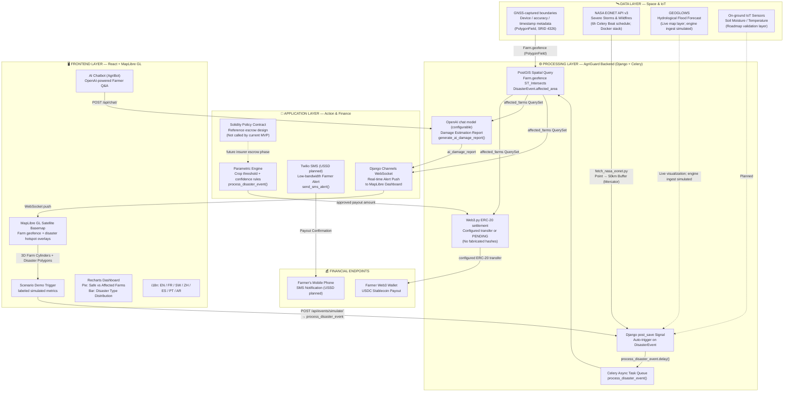

# AgriGuard — 02: System Architecture Diagram

> **Mermaid Format** — Render at https://mermaid.live or in any Mermaid-compatible viewer.

---

## Architecture Overview

AgriGuard follows a four-tier architecture: **Data Layer** (Space & IoT) → **Processing Layer** (Django + Celery) → **Application Layer** (Action & Finance) → **Frontend Layer** (React + MapLibre GL). Each component is annotated with actual code-level function and file references.

---

## Full System Architecture (Mermaid)

---

## Data Flow Summary

| Step | Trigger | Source File | Action |
|:---|:---|:---|:---|
| **Ingest** | Celery Beat (6h, Docker stack) | `fetch_nasa_eonet.py` | Pull NASA EONET → Point → 50km buffer Polygon |
| **Ingest** | Demo Simulator | `Dashboard.jsx` | User toggles disaster simulation for live walkthrough |
| **Auto-trigger** | `post_save` signal | `signals.py` | Any new `DisasterEvent` → `process_disaster_event.delay()` |
| **Spatial query** | Celery worker | `tasks.py` | `Farm.objects.filter(geofence__intersects=area)` |
| **Payout** | Celery worker | `tasks.py` / `blockchain_service.py` | Configured ERC-20 transfer; otherwise record `PENDING` with no fake tx hash |
| **AI report** | Celery worker | `tasks.py` | `generate_ai_damage_report.delay(alert.id)` |
| **WebSocket** | Celery worker | `tasks.py` | `channel_layer.group_send('alerts_group', ...)` |
| **WebSocket fallback** | WebSocket client | `consumers.py` | With an in-memory channel layer, each connection polls the shared database for new `RiskAlert` rows so alerts still reach clients on other server instances |
| **SMS** | Celery worker | `tasks.py` | `send_sms_alert.delay(phone, message)` |

---

## API Access Model

| Surface | Access | Notes |
|:---|:---|:---|
| `GET /api/farms/`, `/api/alerts/`, `/api/claims/`, `/api/events/` | Public read | Lets judges open the live map and claims timeline without credentials |
| `POST /api/events/simulate/` | Authenticated | The frontend performs a silent demo login (`demo` / `demo123`) so the public walkthrough can drive the real pipeline |
| `PATCH` / `PUT` / `DELETE /api/farms/<id>/` | Owner only | Foreign farms return `404`, never a silent mutation |
| `POST /api/farms/<id>/test_sms/`, `test_wallet/` | Owner only | Prevents using the SMS sender as an open relay for arbitrary numbers |
| `GET /api/farms/integration_status/`, `POST /api/chat/` | Authenticated | Contact and payout details are scoped to `request.user` |

`FarmViewSet.get_queryset()` is the single enforcement point: list/retrieve/risk_status keep the public demo working, while every write and per-farm action is filtered to `owner=request.user`.

The live map consumes current Esri layers, while GPS and GNSS evidence remain the spatial anchor for each farm. GEOGLOWS/VIIRS threshold ingestion and the Solidity escrow contract are explicitly separated as roadmap work.

*Part 2 of 5 — AgriGuard Hackathon Submission, July 2026*
