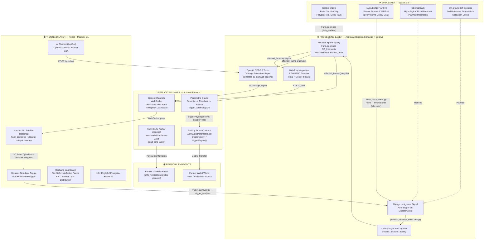

# AgriGuard — 02: System Architecture Diagram

> **Mermaid Format** — Render at https://mermaid.live or in any Mermaid-compatible viewer.

---

## Architecture Overview

AgriGuard follows a four-tier architecture: **Data Layer** (Space & IoT) → **Processing Layer** (Django + Celery) → **Application Layer** (Action & Finance) → **Frontend Layer** (React + Mapbox GL). Each component is annotated with actual code-level function and file references.

---

## Full System Architecture (Mermaid)

---

## Data Flow Summary

| Step | Trigger | Source File | Action |
|:---|:---|:---|:---|
| **Ingest** | Celery Beat (6h) | `fetch_nasa_eonet.py` | Pull NASA EONET → Point → 50km buffer Polygon |
| **Ingest** | Demo Simulator | `Dashboard.jsx` | User toggles disaster simulation for live walkthrough |
| **Auto-trigger** | `post_save` signal | `signals.py` | Any new `DisasterEvent` → `process_disaster_event.delay()` |
| **Spatial query** | Celery worker | `tasks.py` | `Farm.objects.filter(geofence__intersects=area)` |
| **Payout** | Celery worker | `tasks.py` | Web3.py ETH transfer + mock fallback |
| **AI report** | Celery worker | `tasks.py` | `generate_ai_damage_report.delay(alert.id)` |
| **WebSocket** | Celery worker | `tasks.py` | `channel_layer.group_send('alerts_group', ...)` |
| **SMS** | Celery worker | `tasks.py` | `send_sms_alert.delay(phone, message)` |

---

*Part 2 of 5 — AgriGuard Hackathon Submission, July 2026*
