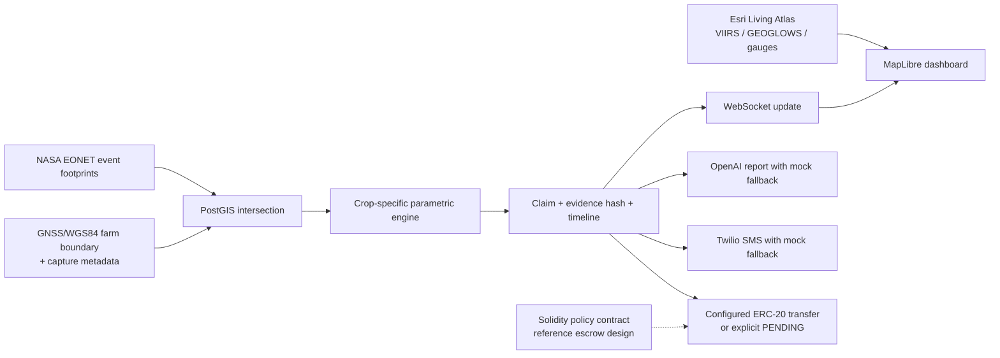

# AgriGuard - Hackathon Submission Package

> **Tagline:** Zero-touch parametric crop insurance and early warning for Africa's smallholder farmers, powered by GNSS-defined farm evidence, Earth observation, and auditable settlement.
>
> **Official event:** GNSS 4 for Space Applications in Africa (G4-SAA) - SATNAV Africa Joint Programme
>
> **Primary challenge:** Challenge II - Synergizing Agriculture and Geomatics
>
> **Secondary relevance:** Challenge I - disaster risk reduction and management

## 1. Implementation Status

AgriGuard is a working MVP. This submission separates implemented capability from simulation and roadmap work:

| Capability | Status |
|:---|:---|
| GNSS/WGS84 farm polygons and optional device/accuracy/timestamp metadata | Implemented |
| PostGIS farm-by-hazard intersection | Implemented |
| Crop-specific flood, drought, wildfire, and heatwave rules | Implemented |
| NASA EONET event-footprint ingestion | Implemented with a six-hour Celery Beat schedule in the Docker worker stack; the Vercel API container does not host the scheduler |
| Esri Living Atlas VIIRS, GEOGLOWS, and gauge layers | Live in the map |
| REST API, JWT, claims, timelines, and WebSocket updates | Implemented |
| OpenAI reports and Twilio SMS | Implemented with safe fallbacks when keys or explicit live gates are absent |
| Configured ERC-20 settlement path | Implemented |
| Solidity policy/escrow contract | Reference design, not called by the current MVP |
| Threshold ingestion from GEOGLOWS/VIIRS | Roadmap; the demo uses labeled simulated metrics |
| Raw NMEA/RINEX trace storage | Roadmap; the MVP stores the resulting WGS84 polygon and GNSS metadata |

AgriGuard never fabricates a blockchain transaction hash. If Web3 credentials or a farmer wallet are unavailable, the claim remains `PENDING`.

## 2. Problem

African smallholder farmers face approximately **$9.3 billion in annual climate losses**, while insurance penetration is below 3%. Traditional crop insurance is poorly matched to small farms because it depends on expensive field visits, manual damage assessment, and claim cycles that can take weeks.

Immediate liquidity matters after a flood, drought, wildfire, or heatwave. A payout that arrives after the planting or recovery window is no longer enough to protect a household from debt, asset sales, or food insecurity.

## 3. Solution

AgriGuard replaces routine manual adjustment with a spatial and parametric workflow:

1. A farmer or field officer captures a farm boundary as a WGS84 polygon and stores optional GNSS metadata.
2. PostGIS identifies farms that intersect an ingested or simulated hazard footprint.
3. A crop-specific rules engine evaluates verified threshold metrics.
4. The system creates an alert, claim, timeline, and SHA-256 evidence hash.
5. If live settlement is explicitly enabled and configured, the backend signs an ERC-20 settlement transfer from the insurer/oracle wallet.
6. The farmer receives an SMS status update, and an AI damage assessment can be generated.

The map provides situational awareness from live Esri layers. The claim engine only uses values marked as verified or explicitly simulated for the demo.

## 4. 250-Word Abstract

**Problem:** Climate disasters cost African agriculture roughly $9.3 billion annually, yet insurance covers less than 3% of smallholder farmers. Traditional insurance fails because verification is expensive, settlements take weeks, and low-income farmers cannot absorb delayed liquidity.

**Solution:** AgriGuard is a GNSS-anchored parametric insurance and early-warning platform. Farms are represented as WGS84 polygons with optional receiver, accuracy, and capture-time metadata. PostGIS evaluates spatial intersections with NASA EONET event footprints and demo hazard areas. A crop-specific engine evaluates flood depth and duration, wildfire area, drought NDWI, or heatwave anomaly and persistence thresholds. Approved claims receive a SHA-256 evidence hash and a transparent claim timeline. When live settlement is explicitly enabled and blockchain credentials are configured, the backend signs an ERC-20 transfer; otherwise the claim remains explicitly `PENDING`. Twilio SMS and OpenAI reports operate with safe fallbacks.

**Innovation:** AgriGuard connects GNSS boundary evidence, geospatial automation, and financial status tracking in one auditable workflow. It does not present the reference Solidity contract, simulated threshold values, or future data integrations as production capabilities.

**Applicability:** The architecture can be reused for other hazards, regions, assets, and feature-phone channels. Relative to manual field verification, it targets faster settlement, lower routine verification cost, and stronger evidence integrity.

**Impact target:** With verified feeds and insurer integrations, AgriGuard targets minute-level claim processing, lower operational costs, improved post-disaster liquidity, and a scalable B2B2C model for underserved farmers.

## 5. Architecture



### Data Flow

| Step | Implementation |
|:---|:---|
| Ingest | In the Docker stack, Celery Beat runs `fetch_nasa_eonet.py` every six hours |
| Spatial query | `Farm.geofence__intersects=event.affected_area` |
| Evaluate | `ParametricClaimEngine.evaluate_farm_status(farm, event)` |
| Approve | `process_payout(...)` applies area caps, severity, and confidence |
| Settle | `BlockchainService.execute_payout(...)` signs a configured ERC-20 transfer |
| Notify | Channels, Twilio, and OpenAI tasks run with safe fallbacks |

## 6. Trigger Logic

### Flood

For maize, a claim is triggered when water level reaches `2.5 m` for at least `3 days`. Wheat and livestock have different thresholds. Rainfall anomaly data can raise confidence from `0.85` to `0.95`.

### Wildfire

For maize, a verified fire area of at least `5 ha` triggers a claim. Smaller positive areas create a warning without a payout.

### Drought

For maize, `NDWI < -0.2` triggers a claim with a confidence score of `0.90`.

### Payout Guardrail

Payouts use insured farm area capped at five hectares, severity, and confidence. This prevents an oversized or incorrectly captured polygon from producing an unrealistic payment.

## 7. GNSS Evidence

- `Farm.geofence` is a GeoDjango `PolygonField(srid=4326)`.
- Registration validates a valid WGS84 polygon before saving.
- `gnss_device_id`, `gnss_accuracy_m`, and `gnss_captured_at` record optional source metadata.
- Claim evidence binds farm ID, event ID, event time, confidence, and GNSS metadata into a SHA-256 hash.
- PostGIS `ST_Intersects` performs the spatial test.
- Raw NMEA/RINEX upload and on-chain policy metadata are roadmap items.

See [`GNSS_DATA_CAPTURE_AND_EVIDENCE.md`](GNSS_DATA_CAPTURE_AND_EVIDENCE.md).

## 8. Settlement Boundary

The current backend uses `core/services/blockchain_service.py` to transfer a configured ERC-20 token from the oracle wallet. It requires:

```dotenv
WEB3_PROVIDER_URI=
WEB3_PRIVATE_KEY=
SMART_CONTRACT_ADDRESS=
WEB3_PAYOUT_DECIMALS=6
LIVE_SETTLEMENT_ENABLED=False
```

The transaction hash is stored only after the node accepts the transfer.
Credentials alone do not enable a real transfer: `LIVE_SETTLEMENT_ENABLED=True`
is also required. A disabled gate, missing configuration, invalid wallet, failed
transfer, or zero amount leaves the claim `PENDING`.

The [reference Solidity contract](../contracts/AgriGuardParametric.sol) defines policy creation, one-time payout, and ERC-20 transfer. It is included to show the next escrow phase and is not deployed or called by the MVP.

## 9. Impact and Market

These figures are targets, not measured pilot results:

| Metric | Traditional benchmark | AgriGuard target |
|:---|---:|---:|
| Claim cycle | 4-12 weeks | Minutes after verified data and configured settlement |
| Routine verification cost | $50-$200 per claim | Materially lower through PostGIS automation |
| Evidence integrity | Paper and subjective assessments | GNSS metadata plus deterministic evidence hash |
| Currency exposure | Local-currency payout | Optional stablecoin settlement path |
| Farmer reach | Large commercial farms | SMS-first access, with USSD on the roadmap |

### Market Thesis

- **TAM context:** 485 million African livelihoods affected by land degradation or climate risk.
- **SAM:** 120 million smallholder farms across Sub-Saharan Africa and Southeast Asia.
- **SOM target:** 120,000 insured farmers by Year 3.
- **Base revenue target:** ~$3M ARR from a $25 annual micro-premium margin.
- **Additional upside:** insurer platform licensing and per-settlement fees.

## 10. Judging Criteria Evidence

| Criterion | Evidence |
|:---|:---|
| Originality | Connects GNSS boundary evidence to parametric agricultural insurance and transparent settlement status |
| Sustainability | Reduces routine field inspection and creates a recurring B2B2C revenue path |
| Significance | Addresses climate risk, food security, and financial inclusion in African agriculture |
| Applicability and transferability | Portable PostGIS/Django architecture; reusable for other hazards, assets, and regions |
| Market potential | Large underserved market, clear insurer distribution path, measurable downstream GNSS/EO demand |
| Impact | Targets faster liquidity, lower verification cost, and auditable evidence |

See [`JUDGING_CRITERIA_MAPPING.md`](JUDGING_CRITERIA_MAPPING.md).

## 11. Responsible Technology

- Demo threshold metrics are labeled as simulated.
- EONET event locations are not treated as claim-grade threshold evidence.
- Missing Web3 configuration creates `PENDING`, not a fake paid claim.
- AI output is advisory and falls back to a deterministic template without an API key.
- Real OpenAI, Twilio, and settlement calls require explicit `LIVE_*_ENABLED` gates in addition to credentials.
- SMS failure does not block claim creation and falls back to mock mode for the demo.
- Production deployment requires a private secret, explicit CORS origins, and replacement of demo credentials.

## 12. Demo and Repository

- Repository: [github.com/juangh123/agri_guard](https://github.com/juangh123/agri_guard)
- Interactive demo: [`INTERACTIVE_DEMO.html`](INTERACTIVE_DEMO.html)
- Demo video: [`AgriGuard_Demo_Final.mp4`](AgriGuard_Demo_Final.mp4) (rebuilt against the current honest-settlement UI)
- Presentation: [`AgriGuard_Presentation_submission.pptx`](AgriGuard_Presentation_submission.pptx)
- Architecture: [`ARCHITECTURE.md`](ARCHITECTURE.md)
- Trigger code: [`TRIGGER_LOGIC_AND_CODE.md`](TRIGGER_LOGIC_AND_CODE.md)

## 13. Team

Jason (`juangh123`) - solo builder.

---

*Prepared for the GNSS 4 for Space Applications in Africa (G4-SAA) hackathon.*
